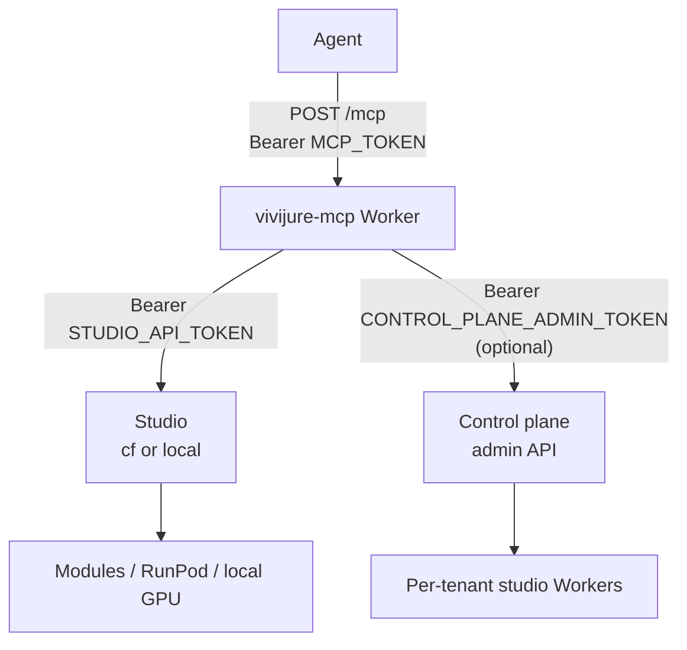

# @skyphusion-labs/vivijure-mcp

**Agent MCP for [Vivijure Studio](https://vivijure.com)** -- drive the film studio (and optionally the
hosted control plane) from Claude, Cursor, or any [Model Context Protocol](https://modelcontextprotocol.io/) client.

Stateless Worker package that proxies **curated tools** to:

1. **Studio HTTP API** (`vivijure-cf` or `vivijure-local` -- same CONTRACT)
2. **Control plane admin API** (`vivijure-control-plane`) when `CONTROL_PLANE_*` is configured

| | |
|--|--|
| **npm** | [`@skyphusion-labs/vivijure-mcp`](https://www.npmjs.com/package/@skyphusion-labs/vivijure-mcp) |
| **Version** | **1.3.0** (109 tools) -- trust `package.json` / tags |
| **License** | AGPL-3.0-only |
| **Product** | https://vivijure.com · demo https://demo.vivijure.com |

## Documentation

| Doc | Contents |
|-----|----------|
| **[docs/mcp.md](docs/mcp.md)** | Deploy Worker, agent wiring, full tool reference, security, troubleshooting |
| **[docs/PARITY.md](docs/PARITY.md)** | Human panel / control-plane console vs MCP tools (honesty matrix) |
| [docs/security-false-positives.md](docs/security-false-positives.md) | Static-analysis notes |
| [CHANGELOG.md](CHANGELOG.md) | Release history |
| [CLAUDE.md](CLAUDE.md) | Repo working notes for agents |

Studio wire contract lives in the **host** repo: `vivijure-cf` / `vivijure-local` `docs/CONTRACT.md`.

## Architecture



- Agent never sees the studio or control-plane secrets (only `MCP_TOKEN`).
- Long jobs are agent-driven poll loops (`submit_film` → `poll_film`, smoke render, etc.).
- Opt-in: default self-host does **not** deploy MCP.

## Install (library)

```bash
npm install @skyphusion-labs/vivijure-mcp
```

Hosts point `wrangler.mcp.toml` `main` at:

```toml
main = "node_modules/@skyphusion-labs/vivijure-mcp/dist/mcp.js"
```

## Deploy (summary)

From **vivijure-cf** or **vivijure-local** (not this package alone):

```bash
# render wrangler.mcp.toml from example (MCP_HOST + MCP_STUDIO_URL)
npm run deploy:mcp
wrangler secret put STUDIO_API_TOKEN -c wrangler.mcp.toml
wrangler secret put MCP_TOKEN -c wrangler.mcp.toml
# optional hosted ops:
# CONTROL_PLANE_URL in [vars]
# wrangler secret put CONTROL_PLANE_ADMIN_TOKEN -c wrangler.mcp.toml
```

Mint a **named studio consumer token** (`scripts/studio-consumer-token.sh mint studio-mcp`) rather than reusing the operator token. Full steps: [docs/mcp.md](docs/mcp.md).

### Agent config (after deploy)

```json
{
  "mcpServers": {
    "vivijure": {
      "url": "https://studio-mcp.example.com/mcp",
      "headers": {
        "Authorization": "Bearer <MCP_TOKEN>"
      }
    }
  }
}
```

(Exact client field names vary; Streamable-HTTP `POST /mcp` with Bearer is the gate.)

## Tool groups (1.3)

| Group | Examples |
|-------|----------|
| Registry / reads | `studio_modules`, `voices`, `whoami`, `list_projects`, `list_cast` |
| Cast identity | portrait, refs, sources, generate/train LoRA (SDXL + Wan), import/export |
| Projects + library | create/save/update projects, organize renders |
| Planning | `plan_storyboard`, `refine_storyboard`, `preflight`, `chat`, enhance/yaml/… |
| Render (spend) | `bundle_storyboard`, `submit_film`, `poll_film`, clips, frames |
| Bytes in / artifacts | `upload_image`, `upload_audio`, `view_artifact`, `artifact_url` |
| Modules / prefs / storage | install modules, patch config, storage reconcile |
| Demo | `demo_*` when host enables demo mode |
| Control plane | `cp_list_tenants`, upgrade studio/modules, smoke, suspend, credits, holds, … |
| Escape hatches | `studio_request`, `control_plane_request` |

**Deliberate gaps:** owner `POST /api/tenant/provision` (session + AUP, not admin bearer); alternate storyboard render doors until cf#334 (use `studio_request`). See [PARITY.md](docs/PARITY.md).

## Hosted bootstrap (operator agent)

1. Human provisions on the front door (signup, AUP, RunPod keys).
2. Agent with admin token: `cp_list_tenants` → `cp_tenant_upgrade_studio` / modules / bindings → `cp_tenant_module_readiness` → `cp_tenant_smoke_render`.
3. Point a studio-target MCP (or same Worker with both targets) at `https://<slug>.studio.vivijure.com` with a tenant API token for creative work.

## Package layout

| Import | Role |
|--------|------|
| `@skyphusion-labs/vivijure-mcp` | Worker `fetch` handler |
| `@skyphusion-labs/vivijure-mcp/mcp-env` | `McpEnv` bindings |
| `@skyphusion-labs/vivijure-mcp/mcp-tools` | `TOOLS` + `runTool` |

## Develop

```bash
npm ci
npm run typecheck
npm test
npm run build
```

## Related repos

- [vivijure-cf](https://github.com/skyphusion-labs/vivijure-cf) -- Cloudflare studio host
- [vivijure-local](https://github.com/skyphusion-labs/vivijure-local) -- self-host / homelab host
- [vivijure-control-plane](https://github.com/skyphusion-labs/vivijure-control-plane) -- multi-tenant provisioner
- [vivijure-core](https://github.com/skyphusion-labs/vivijure-core) -- shared orchestration types

## License

AGPL-3.0-only
