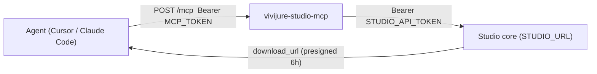

# Vivijure Studio MCP

Drive your Vivijure studio from an AI agent (Claude Code, Cursor, or any Model Context Protocol
client) instead of raw `curl` or the browser. Implementation lives in **`@skyphusion-labs/vivijure-mcp`**
(`src/mcp.ts`). Host repos (`vivijure-cf`, `vivijure-local`) supply only wrangler/deploy config.

It is **opt-in and off by default.** A default self-host does not deploy it. If you never point an
agent at your studio, you can skip this page entirely.

This page is written so you can go from a working studio to a working agent connection using only
what is written here. If a step does not work, see [Troubleshooting](#troubleshooting) at the bottom.

## Contents

- [Why a separate Worker](#why-a-separate-worker)
- [Before you start](#before-you-start)
- [Deploy the MCP Worker](#deploy-the-mcp-worker)
- [Check that it works](#check-that-it-works)
- [Connect your agent](#connect-your-agent)
- [How tool calls behave](#how-tool-calls-behave)
- [Tool reference](#tool-reference) (all 19 tools, with arguments)
- [A render, end to end](#a-render-end-to-end)
- [Security boundary](#security-boundary)
- [Troubleshooting](#troubleshooting)
- [Files](#files)

## Why a separate Worker

- **Two credentials, two surfaces.** The agent presents `MCP_TOKEN` to the MCP; the studio bearer
  (`STUDIO_API_TOKEN`) never leaves the Worker. You can rotate either one without touching the other.
- **No studio bindings.** The MCP holds no D1, R2, or module bindings. It reaches the studio purely
  over HTTP at `STUDIO_URL`, so it can point at any instance: your self-hosted studio, or one running
  somewhere else.
- **Stateless.** Long-running renders are agent-driven: `submit_film` returns a job id, then the
  agent calls `poll_film` until the `phase` is `done` (a presigned `download_url` appears) or
  `failed`. The Worker holds no job state and never long-polls.



## Before you start

You need:

1. **A deployed studio** reachable over HTTPS (see [DEPLOYMENT.md](DEPLOYMENT.md) or
   [quickstart.md](quickstart.md)), running in token mode (`AUTH_MODE=token`, the default).
2. **A studio API token for the MCP to use.** Best practice is a **named consumer token**, not the
   operator token, per the per-function-keys rule: if it ever leaks you revoke one consumer, and
   MCP-driven requests show up in observability as `api-token:studio-mcp` instead of blending into
   operator traffic. Mint one on the studio side:

   ```sh
   scripts/studio-consumer-token.sh mint studio-mcp
   ```

   This inserts only the token's SHA-256 hash into the studio's D1 `api_tokens` table and writes the
   plaintext to a local `chmod 600` file exactly once. That value is what you will seed as the MCP
   Worker's `STUDIO_API_TOKEN` secret in the next section (the secret NAME on the MCP Worker is
   always `STUDIO_API_TOKEN`, whatever class of studio token you put in it). Reusing the operator
   token works too; it is just worse hygiene. Details: [SECURITY.md](SECURITY.md) section 1b.
3. **A custom domain** for the MCP host (for example `studio-mcp.example.com`) on the same
   Cloudflare zone. `workers.dev` is deliberately disabled in the example config.
4. `wrangler` authenticated against your Cloudflare account (the same setup the studio deploy uses).

## Deploy the MCP Worker

The Worker needs exactly three values:

| Value | Kind | What it is |
|-------|------|------------|
| `STUDIO_URL` | var (in `wrangler.mcp.toml`) | The base URL of your studio, e.g. `https://studio.example.com`. No trailing slash needed (it is normalized). |
| `STUDIO_API_TOKEN` | secret | The studio bearer the MCP presents on every forwarded call (the named consumer token from above). |
| `MCP_TOKEN` | secret | The gate. Every agent request must carry `Authorization: Bearer <MCP_TOKEN>`. |

The two secrets are seeded once, out-of-band, never in CI.

```sh
# 1. Render wrangler.mcp.toml from the committed example (host + studio URL), or copy the example
#    and fill the two ${...} placeholders by hand.
MCP_HOST="studio-mcp.example.com" MCP_STUDIO_URL="https://studio.example.com" \
  envsubst '$MCP_HOST $MCP_STUDIO_URL' < wrangler.mcp.toml.example > wrangler.mcp.toml

# 2. Deploy the Worker.
npm run deploy:mcp

# 3. Seed the studio bearer (the named consumer token minted in "Before you start").
wrangler secret put STUDIO_API_TOKEN -c wrangler.mcp.toml

# 4. Mint + set the MCP gate token (keep a chmod 600 copy to wire clients with; delete it once
#    your client config holds it).
umask 077 && openssl rand -hex 32 > mcp-token.txt
wrangler secret put MCP_TOKEN -c wrangler.mcp.toml < mcp-token.txt
```

**The CI path (this repo's tag-gated deploy):** the MCP deploys as the last step of a `v*` tag
deploy ONLY when both `MCP_HOST` and `MCP_STUDIO_URL` repo **variables** are set; when they are not,
the step is a clean no-op, so a fork that never opts in never deploys it. The two secrets are never
set in CI; seed them once with steps 3 and 4 above and they survive redeploys.

**Local dev:** `npm run dev:mcp` runs the Worker under `wrangler dev` against whatever
`STUDIO_URL` your rendered `wrangler.mcp.toml` points at.

## Check that it works

Two checks, no MCP client needed. First the open health route:

```sh
curl -s https://studio-mcp.example.com/health
# {"ok":true,"service":"vivijure-studio-mcp"}
```

Then an authenticated `tools/list` (this proves the gate and the JSON-RPC transport):

```sh
curl -s https://studio-mcp.example.com/mcp \
  -H "Authorization: Bearer $(cat mcp-token.txt)" \
  -H "Content-Type: application/json" \
  -d '{"jsonrpc":"2.0","id":1,"method":"tools/list"}'
```

You should get a JSON-RPC result listing all 19 tools. The same request **without** the header must
return `401` -- if it does not, stop and check your `MCP_TOKEN` seeding before wiring any client.

Note the split: a missing or wrong `MCP_TOKEN` fails at the door (`401`), but a missing or wrong
`STUDIO_API_TOKEN` only shows up when a tool actually calls the studio (an `isError` tool result).
The `tools/list` check above therefore does NOT prove the studio leg; the first real tool call does.
`studio_modules` is a good, free, read-only choice for that.

## Connect your agent

Both examples present the same `MCP_TOKEN` as a bearer against `https://<MCP_HOST>/mcp`.

Claude Code (native HTTP transport, user scope):

```sh
claude mcp add-json vivijure-studio \
  '{"type":"http","url":"https://studio-mcp.example.com/mcp","headers":{"Authorization":"Bearer <MCP_TOKEN>"}}' \
  -s user
```

Cursor (`~/.cursor/mcp.json`), via the `mcp-remote` bridge:

```json
"vivijure-studio": {
  "command": "npx",
  "args": ["-y", "mcp-remote@latest", "https://studio-mcp.example.com/mcp",
           "--header", "Authorization:${AUTH_HEADER}"],
  "env": { "AUTH_HEADER": "Bearer <MCP_TOKEN>" }
}
```

Any other MCP client works the same way: streamable-HTTP transport, one endpoint (`POST /mcp`),
`Authorization: Bearer <MCP_TOKEN>` on every request. The Worker speaks JSON-RPC 2.0
(`initialize`, `ping`, `tools/list`, `tools/call`); notifications (requests with no `id`) are
accepted with `202` and no body.

## How tool calls behave

Rules that hold for every tool, so the reference below does not repeat them:

- **One tool call = one studio HTTP request.** Each curated tool maps to exactly one route in
  [CONTRACT.md](CONTRACT.md); that document is the authority on full request and response shapes.
  This page tells you which route each tool hits so you always know where to look deeper.
- **Errors are data, not crashes.** A bad argument, a studio-side `4xx/5xx`, or an unset
  `STUDIO_API_TOKEN` all come back as an MCP tool result with `isError: true` and a readable
  message, so the agent can correct itself. Only a bad `MCP_TOKEN` is a transport-level `401`.
- **Every result is prefixed with the wire line** (`GET /api/modules -> 200`) followed by the
  pretty-printed JSON reply, so you can always see what was actually called and what came back.
- **Forward-compatible bodies.** POST/PATCH tools forward their WHOLE argument object as the request
  body (minus path parameters like `id`). If the studio contract grows a new optional field, the
  agent can pass it through the existing tool immediately; the fields listed below are the
  documented ones, not a hard allowlist.
- **No binary through the transcript.** Binary responses (video, image, tar, zip) are summarized
  with their content type and size, never inlined. For a finished film use `poll_film`'s
  `download_url`; other artifacts live at `GET /api/artifact/<key>`. Non-JSON text is capped at
  4000 characters.
- **No binary uploads either.** To set a portrait, generate the image with `chat` and pass the
  returned artifact key to `set_cast_portrait`; nothing is ever base64-smuggled through a tool call.

## Tool reference

Nineteen tools in four groups. Arguments marked **(required)** must be present; everything else is
optional. Response shapes below show the fields you will steer by; [CONTRACT.md](CONTRACT.md) has
the full schemas.

### Registry and reads (free, safe to call any time)

**`studio_modules`** -- `GET /api/modules`. No arguments. The registry projection the whole studio
renders from: installed modules and their `config_schema`, which module serves each hook
(pre-sorted), the hook catalog, and `render.quality_tiers` + `default_tier`. **Read this first**: it
is where you discover valid `motion.backend` names, quality tiers, and what your studio can do.

**`voices`** -- `GET /api/voices`. No arguments. The 12 valid Aura-1 speaker ids with labels. These
are the only legal `voice_id` values for `update_cast`.

**`storyboard_models`** -- `GET /api/storyboard/models`. No arguments. The planning model catalog:
the model ids accepted by `plan_storyboard`, `refine_storyboard`, and `chat`.

**`list_cast`** -- `GET /api/cast`. No arguments. Every cast member: id, name, bible, portrait,
LoRA status, voice.

**`get_cast`** -- `GET /api/cast/:id`. One cast member.
- `id` (required): the cast member's public id.

**`list_projects`** -- `GET /api/storyboard/projects`. No arguments. Every storyboard project.

**`get_project`** -- `GET /api/storyboard/projects/:id`. One project, including its last saved
storyboard.
- `id` (required): the project's public id.

**`list_renders`** -- `GET /api/storyboard/renders`. The render library (history rows).
- `project_id`: filter to one project's renders.
- `limit`: max rows (default 100).

### Cast

**`create_cast`** -- `POST /api/cast`. Create a cast member.
- `name` (required): display name.
- `bible`: the character description / bible.

**`update_cast`** -- `PATCH /api/cast/:id`. Update a cast member; send only what you are changing.
- `id` (required): the cast member's public id.
- `name`: new display name.
- `bible`: new character bible.
- `voice_id`: one of the 12 ids from `voices`, or empty string / null to clear the voice.

**`set_cast_portrait`** -- `POST /api/cast/:id/portrait`. Set a cast member's portrait (the identity
seed the render pipeline keys on) by copying an image that `chat` already produced.
- `id` (required): the cast member's public id.
- `from_chat_artifact` (required): the `output_artifact.key` returned by a `chat` image call.

The flow is always: `chat` with an image model, take `output_artifact.key` from its reply, pass it
here. There is no direct upload path over MCP.

### Planning (LLM calls; costs inference, not GPU render time)

**`plan_storyboard`** -- `POST /api/storyboard/plan`. Plan a storyboard from a brief with an LLM.
- `brief` (required): the film brief / prompt to plan from.
- `model` (required): a planning model id from `storyboard_models`.
- `characters`: optional character definitions to plan around.
- `beatBlock`: optional beat-structure block.

Returns a validated storyboard on `200`; a plan the validator rejects comes back as `422` with the
errors (which the agent sees as an `isError` result it can retry from).

**`refine_storyboard`** -- `POST /api/storyboard/refine`. Refine an existing storyboard with an
instruction.
- `storyboard` (required): the storyboard object to refine.
- `message` (required): the refinement instruction ("make shot 3 a night scene").
- `model` (required): a planning model id from `storyboard_models`.

Same return contract as `plan_storyboard`: `200` with the new storyboard, or `422` with errors.

**`preflight`** -- `POST /api/storyboard/preflight`. Pre-render validation. Always returns `200`
with `{ ok, counts, issues }`: **problems are data, not an HTTP error.** Run this before
`submit_film` and do not submit until `ok` is `true` (or you have read every issue and decided it
is acceptable).
- `storyboard` (required): the storyboard to validate.
- `castBindings`: `{ [slot]: cast_id }` bindings, if the storyboard uses cast slots.
- `bundleKey`: an already-assembled bundle key, if validating one.
- `audioKey`: a staged audio bed key, if any.

**`chat`** -- `POST /api/chat`. The planner assistant and image generator, one tool.
- `model` (required): a model id (text or image; see `storyboard_models` and the module registry).
- `user_input` (required): the prompt.

A text model returns `{ output }`. An image model returns `{ output_artifact: { key, mime } }`;
feed that `key` to `set_cast_portrait`.

### Render (SPENDS MONEY)

**`bundle_storyboard`** -- `POST /api/storyboard/bundle`. Assemble a render bundle (storyboard +
cast references) into R2 and return its `bundleKey`, the required input to `submit_film`. This step
itself does not spend GPU time.
- `storyboard` (required): the storyboard to bundle.
- `characterRefs` (required): `{ [slot]: ref }` cast references (see
  [CAST-BUNDLE.md](CAST-BUNDLE.md) for the ref shape; the Slate client is the reference consumer).

**`submit_film`** -- `POST /api/render/film`. **STARTS A FILM RENDER. This spends real money** (GPU
seconds on the render backend, or cloud i2v per-clip billing, depending on the motion backend).
There is no undo; treat every call like clicking a "charge my account" button.
- `bundle_key` (required): the `bundleKey` from `bundle_storyboard`.
- `scenes` (required): non-empty array of `{ shot_id, prompt, seconds }`.
- `project`: project namespace (derived from `bundle_key` when omitted).
- `motion_backend` (required in practice): a `motion.backend` module name from `studio_modules`.
  A film is a full render, and a full render REQUIRES an explicit backend: an omitted or
  non-serving value is rejected at submit with a `400` listing the installed backend names
  (#500/#504) -- the studio never silently picks one for you.
- `keyframe_config`: keyframe module config, e.g. `{ "quality_tier": "..." }` (tiers come from
  `studio_modules`).
- `motion_config`: motion module config (knobs per that module's `config_schema`).
- `finish_config`: `{ [moduleName]: config }` for the per-shot `finish` chain (upscale, lipsync, audio).
  Upscale model guidance (#585): the default is `realesr-animevideov3`. `RealESRGAN_x4plus`
  gives a truer photoreal texture but is currently an explicit opt-in that CUDA-OOMs on
  long/high-fps clips until the upscale handler gains tiled inference; leave the default unless
  you know your clips are short.
- `speech_config`: `{ [moduleName]: config }` for the `speech` chain (per-shot dialogue-audio
  cleanup / enhancement, post-dialogue and pre-finish).
- `film_finish_config`: `{ [moduleName]: config }` for the `film.finish` chain on the assembled,
  muxed film. **This is where subtitle mode lives** (`burn` / `sidecar` / `both`) and the
  film-titles knobs. Putting subtitle config under `finish_config` instead validates against the
  per-shot finish chain, silently no-ops, and the subtitle module falls back to `burn` (no
  sidecar, no error) -- so subtitle mode is reachable ONLY through `film_finish_config`.
- `master_config`: `{ [moduleName]: config }` for the `master` chain (assembled film's audio bed
  -> mastered audio: music upscale + loudness, pre-mux).
- `audio_key`: a staged audio bed to mux in after assemble.
- `film_titles`: `{ title?: { text, subtitle? }, credits?: { lines } }` title cards.
- `dialogue_lines`: `[{ shot_id, text, voice_id? }]` spoken lines for TTS + captions. A line's
  `voice_id` (a name from the `voices` tool) always wins; omit it and pass `cast_loras` to speak
  with the cast member's own voice.
- `cast_loras`: `{ [slot]: castId }` -- bind storyboard character slots (`A`, `B`, ...) to cast ids
  from `list_cast`. This drives BOTH the keyframe LoRAs (the character's face) and each speaking
  slot's voice.

**Voices, in one rule:** explicit `dialogue_lines` win over bundle-derived dialogue; a line's own
`voice_id` wins over the cast voice; a voiceless line uses the cast voice of its shot's speaking
slot (via `cast_loras`); only when nothing maps does it fall to the studio default voice. If your
cast member "has a voice in the UI" but the film speaks with the default, you forgot `cast_loras`.

Returns `{ film_id, phase }`. Nothing renders any further unless you poll.

**`poll_film`** -- `GET /api/render/film/:id`. Advance and poll a film job **one tick**. The
pipeline moves when you poll, so poll steadily (every 10 to 30 seconds is plenty) until it settles.
- `id` (required): the `film-<...>` job id from `submit_film`.

Returns `{ phase, clips?, finish?, film_key?, download_url? }`. Phases, in order:
`keyframe`, `clips`, `dialogue`, `speech`, `finish`, `assemble`, `master`, `mux`, then terminally
`done` or `failed`. On `done`, `download_url` is a presigned link to the finished film with a
**6 hour TTL** (`FILM_DOWNLOAD_TTL_SECONDS`); download it before it expires (a later `poll_film` re-issues a fresh one). On
`failed`, the payload carries the real per-shot error: the studio never silently ships an
unfinished film.

### Escape hatch

**`studio_request`** -- any studio route in [CONTRACT.md](CONTRACT.md) that has no curated tool
(render/clips, scatter, renders PATCH/DELETE, prefs, cast LoRA training, cast bundle
import/export, ...).
- `method` (required): one of `GET`, `POST`, `PATCH`, `PUT`, `DELETE`.
- `path` (required): the studio path, starting with `/`, e.g. `/api/storyboard/renders/tags`.
- `query`: optional query params (string/number values).
- `body`: optional JSON request body.

Same bearer, same result formatting, same binary summarization as every other tool. It is a raw
pass-through: anything the studio bearer can do, this can do, including spend and delete routes.

## A render, end to end

The full happy path, with the arguments that matter. Steps 1 through 4 are free; step 5 spends.

1. **`studio_modules`** -- note a name under `hooks["motion.backend"]` and the
   `render.quality_tiers`.
2. **`plan_storyboard`** with `{ brief, model }` (model from `storyboard_models`); optionally
   iterate with **`refine_storyboard`** until the storyboard reads right.
3. **`preflight`** with `{ storyboard }` (plus `castBindings` if you cast it) -- keep fixing and
   re-running until `ok: true`.
4. **`bundle_storyboard`** with `{ storyboard, characterRefs }` -- keep the returned `bundleKey`.
5. **`submit_film`** with `{ bundle_key, scenes, motion_backend, keyframe_config: { quality_tier } }`
   -- keep the returned `film_id`. **This is the spend line.**
6. **`poll_film`** with `{ id: film_id }` every 10 to 30 seconds. Watch `phase` walk the pipeline;
   stop on `done` (grab `download_url`, valid 6h) or `failed` (read the per-shot error, fix,
   resubmit).

## Security boundary

- The MCP is machine-to-machine only, gated by `MCP_TOKEN` (fail closed: unset or wrong token is a
  `401`, and an UNSET `MCP_TOKEN` on the Worker refuses everything rather than opening up). It is a
  full write path to the studio, **including spend routes** (`submit_film`) and, via
  `studio_request`, delete routes. Treat `MCP_TOKEN` with exactly the care you give the studio
  bearer itself.
- Give the MCP its own named consumer token (see [Before you start](#before-you-start)) so a leak
  burns one credential, rotation touches one consumer, and MCP traffic is attributable in the
  observability stream.
- Keep it on a custom domain (`workers.dev` stays disabled in the example config) so the bearer gate
  is not the only thing between the public internet and your studio credential.
- `studio_request` is bounded in FORMAT (JSON in/out, binary summarized) but not in REACH. The gate
  is the control, not per-tool allowlisting: anyone holding `MCP_TOKEN` holds the studio.

## Troubleshooting

| Symptom | Meaning | Fix |
|---------|---------|-----|
| `401 {"error":"unauthorized"}` on `/mcp` | Missing/wrong `MCP_TOKEN` header, or the `MCP_TOKEN` secret is unset on the Worker (it fails closed). | Re-check the client's `Authorization: Bearer` value; re-seed with `wrangler secret put MCP_TOKEN -c wrangler.mcp.toml`. |
| Tool result: `MCP is not configured: STUDIO_API_TOKEN is unset.` | The gate passed but the Worker has no studio bearer to forward with. | Seed `STUDIO_API_TOKEN` (step 3 of [Deploy](#deploy-the-mcp-worker)). |
| Tool result: `STUDIO_URL is not configured` | The rendered `wrangler.mcp.toml` deployed without the var. | Re-render from the example with `MCP_STUDIO_URL` set and redeploy. |
| Tool result line ends `-> 401` or `-> 403` | The MCP reached the studio, but the studio rejected the bearer (revoked/rotated token, or the studio is not in token mode). | Mint a fresh consumer token on the studio (`scripts/studio-consumer-token.sh mint studio-mcp`), re-seed `STUDIO_API_TOKEN`; confirm the studio's `AUTH_MODE`. |
| Tool result line ends `-> 422` | The studio validated your body and rejected it (planner output, bad storyboard). | The errors are in the reply body; fix and retry. It is data, not an outage. |
| `Studio request failed (transport): ...` | The Worker could not reach `STUDIO_URL` at all (DNS, TLS, studio down). | Check the studio's own health, then the `STUDIO_URL` value. |
| `poll_film` never advances | The pipeline only moves when polled. | Keep polling on a steady cadence; a phase can legitimately take minutes of wall clock (GPU cold starts). |
| `download_url` gives an error after a while | The presigned link has a 6h TTL. | Call `poll_film` again on the same `film_id`; a `done` film re-issues a fresh URL. |

## Files

Package paths (import as `@skyphusion-labs/vivijure-mcp`, etc.):

- `src/mcp.ts` -- transport, bearer gate, JSON-RPC dispatch (default export for Worker `main`).
- `src/mcp-tools.ts` -- tool catalog + studio-call dispatch + `studio_request`.
- `src/mcp-env.ts` -- `McpEnv` binding surface.

Host deploy wiring: `vivijure-cf/wrangler.mcp.toml.example` (or `vivijure-local` equivalent).
- `wrangler.mcp.toml.example` -- the committed config template (real `wrangler.mcp.toml` gitignored).
- `tests/mcp.test.ts` -- transport + dispatch tests.
